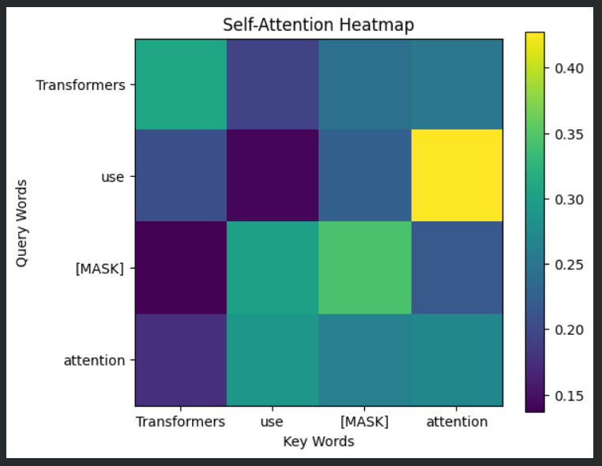
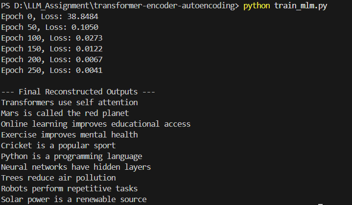

# 🧪 Experiment 1: Transformer Encoder – Autoencoding (Masked Language Model)

## 📌 Objective
To understand and implement a Transformer Encoder and study:
- Self-Attention mechanism
- Autoencoding using Masked Language Modeling (MLM)
- Text reconstruction using masked words
- Visualization of attention weights

---

## 📖 Problem Statement
1. Given an input sentence with a masked word (`[MASK]`), reconstruct the missing word.
2. Use a Transformer Encoder to learn contextual relationships between words.
3. Visualize self-attention weights to understand how the model focuses on different words.

Example:  
Input  : Transformers use [MASK] attention  
Output : Transformers use self attention  

---

## 📂 Dataset
The experiment uses a dataset of 10 masked sentences.

ID | Masked Input Sentence | Expected Output
---|----------------------|----------------
1 | Transformers use [MASK] attention | self
2 | Mars is called the [MASK] planet | red
3 | Online learning improves [MASK] access | educational
4 | Exercise improves [MASK] health | mental
5 | Cricket is a [MASK] sport | popular
6 | Python is a [MASK] language | programming
7 | Neural networks have [MASK] layers | hidden
8 | Trees reduce [MASK] pollution | air
9 | Robots perform [MASK] tasks | repetitive
10 | Solar power is a [MASK] source | renewable

---

## 🏗️ System Architecture

Input Sentence  
↓  
Tokenization  
↓  
Word Embedding  
↓  
Self-Attention (Transformer Encoder)  
↓  
Feed Forward Layer  
↓  
Softmax  
↓  
Masked Word Prediction  

---

## 🔍 Autoencoding with Masked Language Model
Masked Language Modeling replaces one word in the sentence with `[MASK]`.  
The Transformer Encoder predicts the masked word using surrounding context, enabling autoencoding without recurrence.

---

## 🔬 Self-Attention Mechanism
Self-attention allows each word to attend to every other word in the sentence, capturing global dependencies efficiently.

---

## 📁 Project Structure

transformer-encoder-autoencoding/  
├── dataset.py  
├── positional_encoding.py  
├── attention.py  
├── encoder.py  
├── train_mlm.py  
├── visualize_attention.ipynb  
└── results/  
  ├── attention_heatmap.png  
  └── experiment_output.png  

---

## ⚙️ Installation & Requirements

Requirements:
- Python 3.8+
- PyTorch
- NumPy
- Matplotlib
- Jupyter Notebook

Install dependencies:
pip install torch numpy matplotlib notebook

---

## ▶️ How to Run

Step 1: Train the model  
python train_mlm.py  

Step 2: Visualize attention  
jupyter notebook  
Open visualize_attention.ipynb  

---

## 📊 Attention Visualization

The heatmap shows how each word attends to others in the sentence.  
Brighter colors indicate stronger attention for the masked token.

---

## 🧪 Experiment Output (Image)

Below is the output generated after training the Transformer Encoder, showing the reconstructed sentences:

The model successfully reconstructs all masked words using contextual information.

---

## 📈 Result
The Transformer Encoder successfully reconstructed **all 10 masked sentences correctly** using self-attention.

---

## 📚 Learning Outcomes
- Understanding Transformer Encoder architecture
- Knowledge of self-attention mechanism
- Practical experience with Masked Language Modeling
- Visualization and interpretation of attention weights

---

## 🆚 Comparison with Traditional Models

Feature | RNN / CNN | Transformer
-------|-----------|------------
Parallel Processing | No | Yes
Long Dependency Handling | Weak | Strong
Attention Mechanism | No | Yes

---

## ✅ Conclusion
The experiment demonstrates that the Transformer Encoder effectively reconstructs masked text using self-attention and captures global contextual information more efficiently than traditional models.

---

## 👨‍🎓 Author
Name: Naveenkumar N  
Course: BE Computer Science and Engineering  
Institution: MIT Chennai  

---

## 📌 Status
Experiment completed successfully.
