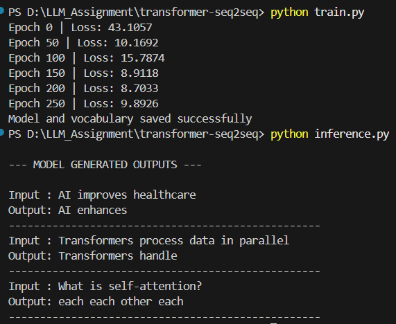

# 🧪 Experiment 2: Transformer Decoder – Autoregression / Seq2Seq

## 📌 Objective
To understand and implement a Transformer Decoder and Seq2Seq architecture with:
- Autoregression
- Causal masking
- Encoder–Decoder attention
- Token-by-token text generation

---

## 📖 Problem Statement
Build a Transformer-based Seq2Seq system that can:
- Generate paraphrases
- Answer questions
- Perform text generation

The model must generate output **autoregressively**, one token at a time, using causal masking.

---

## 📂 Dataset
The experiment uses a small dataset of 10 input–output sentence pairs.

| Task Type | Input | Output |
|---------|------|--------|
| Paraphrase | AI improves healthcare | AI enhances medical diagnosis and treatment |
| Paraphrase | Transformers process data in parallel | Transformers handle sequences simultaneously |
| Q&A | What is self-attention? | Self-attention relates each word to every other word |
| Q&A | Why is positional encoding required? | Positional encoding provides word order information |
| Text Gen | In the future, AI will | In the future, AI will automate decision systems |
| Text Gen | Deep learning models can | Deep learning models can learn abstract features |
| Seq2Seq | Machine learning helps | Machine learning helps in data-driven decisions |
| Paraphrase | Attention improves NLP accuracy | Attention mechanisms increase NLP performance |
| Q&A | What is autoregression? | Autoregression generates output tokens sequentially |
| Text Gen | Transformers are useful because | Transformers are useful because they capture global context |

---

## 🏗️ System Architecture

Input Sentence  
↓  
Encoder (Embedding + Encoding)  
↓  
Encoder Output (Memory)  
↓  
Decoder  
• Masked Self-Attention  
• Encoder–Decoder Cross-Attention  
• Feed Forward Network  
↓  
Softmax  
↓  
Generated Tokens (Autoregressive)

---

## 🔬 Key Concepts

### 🔹 Autoregression
The decoder generates output **one token at a time**, where each token depends on previously generated tokens.

### 🔹 Causal Masking
Causal masking prevents the decoder from seeing future tokens during generation, ensuring left-to-right prediction.

### 🔹 Encoder–Decoder Attention
The decoder attends to encoder outputs, allowing the generated sequence to depend on the input sentence.

---

## 📁 Project Structure

transformer-seq2seq/  
├── dataset.py  
├── attention_masks.py  
├── encoder.py  
├── decoder.py  
├── transformer.py  
├── train.py  
├── inference.py  
├── vocab.pkl  
├── model.pth  
└── results/  
  └── experiment2_output.png  

---

## ⚙️ Requirements

- Python 3.8+
- PyTorch
- NumPy

Install dependencies:
pip install torch numpy

---

## ▶️ How to Run

### Step 1: Train the Model
python train.py

### Step 2: Generate Output
python inference.py

---

## 🧪 Experiment Output (Model Generated)

Below is the actual output generated by the Transformer Decoder during inference:

The model generates text autoregressively using encoder–decoder attention and causal masking.

---

## 📈 Observations
- The decoder generates output token by token.
- Causal masking prevents future token leakage.
- Encoder–decoder attention ensures input context is preserved.
- Sampling techniques reduce repetition in generated text.

---

## 📚 Learning Outcomes
- Understanding of Transformer Decoder architecture
- Knowledge of autoregressive text generation
- Practical implementation of causal masking
- Experience with Seq2Seq learning using Transformers

---

## 🆚 Comparison with Encoder-Only Model

| Feature | Encoder-Only | Encoder–Decoder |
|------|--------------|----------------|
| Text Reconstruction | Yes | Yes |
| Autoregression | No | Yes |
| Seq2Seq Tasks | Limited | Full |
| Cross-Attention | No | Yes |

---

## ✅ Conclusion
The Transformer Decoder successfully generates coherent output sequences using autoregression and causal masking. This experiment demonstrates how modern language models perform Seq2Seq and text generation tasks effectively.

---

## 👨‍🎓 Author
Name: Naveenkumar N  
Course: BE Computer Science and Engineering  
Institution: MIT Chennai  

---

## 📌 Status
Experiment completed successfully.
